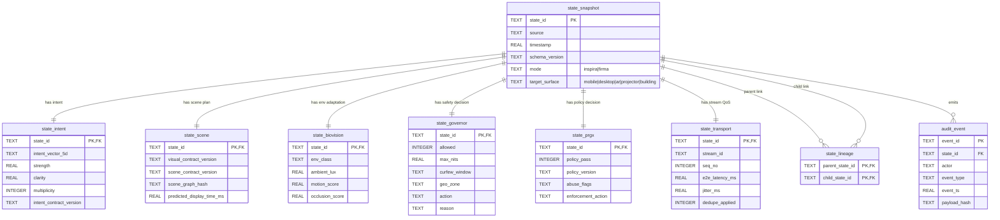

# Logenesis 1.5

Logenesis 1.5 is a production-oriented reference implementation for RFC-LGN-1.5-001, a **conversational reasoning architecture** (not a generic chatbot).

## Core Pipeline

`User Input -> Constitution -> Context Governor -> Dialogue Ledger -> Reasoning Router -> (Fast|Deliberative) -> Response Planner -> MIRAS Memory Stack`

## Key Safety Guarantees

- Public responses are separated from hidden internal reasoning.
- Optional multi-path reasoning is bounded and internal-only.
- Unverified reasoning cannot commit to long-term memory.
- Long-term memory writes are only possible via MIRAS Commit Gate.
- Context continuity is derived from structured state, not full transcript replay.

## Repository Map

- `docs/` architecture, RFC rewrite, schema docs, flows, and decisions
- `src/logenesis/` implementation modules
- `tests/` unit/integration skeleton with deterministic fixtures
- `config/` example policies and thresholds
- `examples/` runnable usage flows

---

## Augmented Perception Layer — High-Level Architecture (1-page summary)

> Vision anchor: **Light is a connector, not merely a representation layer**. ATR-MF acts as a super-layer above existing OS surfaces and can shape-shift into Android/iOS/Windows mode when the intent requires native app continuity.

### Input assumptions used for this draft

- Horizon: **6–12 months** for PoC → pilot hardening.
- Target devices: **mobile / desktop / VR-AR glasses / projector edge box / building projection controllers**.
- Business/legal constraints: **geo-fencing, curfew, luminance and road-safety restrictions, auditable policy enforcement, content accountability**.
- Suggested stack: **Python + TypeScript control plane, Rust/WASM for edge runtime, WebRTC/QUIC for low-latency streaming, SQLite/Postgres for policy and snapshot state, OpenTelemetry for observability**.

### Layered architecture

1. **Intent & Contract Layer (Manifest + Genesis)**
   - `Manifest` defines Intent Contract + Visual Contract + Scene Contract (versioned).
   - `Genesis` transforms voice/intent into validated visual plan + scene graph candidates.

2. **Perception & Adaptation Layer (BioVision)**
   - Continuously scores environment (day/night/fog/rain/shadow/motion/occlusion).
   - Emits adaptation directives so projected light blends contextually and remains legible/safe.

3. **Governance & Safety Layer (Governor + PRGX)**
   - `Governor`: brightness/frequency/curfew/geo rules and fail-safe degradations.
   - `PRGX`: policy engine + enforcement point + abuse prevention + audit trail.

4. **Realtime Transport Layer (Tachyon)**
   - Time-synchronized command/data stream with monotonic timestamps + predicted display time.
   - Handles ordering, jitter buffering, retries, dedupe, and backpressure.

5. **Execution Layer (Edge/WASM Runtime + Renderers)**
   - Device-local composition for low latency.
   - Supports duality mode:
     - **Inspira mode**: light-native interface.
     - **Firma mode**: fallback/bridge to native Android/iOS/Windows UX.

6. **State & Audit Persistence Layer (DB-oriented)**
   - Normalized state snapshots + governance outcomes + lineage for replay and forensic audit.

---

## C4-style Text Diagram

### C1 — Context

- **Actors**
  - End User (voice/intent)
  - Developer (writes intent + visual contracts once)
  - Enterprise/Media Operator (campaign orchestration 24/7)
  - Regulator/Community Admin (policy oversight)
- **System**
  - ATR-MF Augmented Perception Layer
- **External Systems**
  - Existing OS/apps (Android/iOS/Windows)
  - Device fabric (projector/display/AR glasses)
  - Identity & policy admin

### C2 — Containers

- `API Gateway`: authn/authz, tenancy routing, rate limits.
- `Genesis Service`: NLP/intent parsing, scene planning.
- `Manifest Registry`: contract schemas, compatibility map, signing.
- `BioVision Service`: perception inference and adaptation outputs.
- `Governor Service`: environmental/time/location constraint evaluation.
- `PRGX Service`: abuse/policy/safety gate and audit decisions.
- `Tachyon Stream Fabric`: real-time command + media transport.
- `Edge Runtime (WASM)`: local sync, final composition, fallback logic.
- `State Store`: snapshots + lineage + governance outcomes.
- `Observability Stack`: logs/metrics/traces/events/audit export.

### C3 — Components (core modules)

- **Manifest**
  - Intent Contract schema registry
  - Visual/Scene contract validator
  - Version resolver (backward compatibility)
- **Genesis**
  - Voice-to-intent parser
  - Planner (intent→scene graph)
  - Duality mapper (Inspira/Firma target)
- **BioVision**
  - Layer segmentation (foreground/background)
  - Motion estimator
  - Environment classifier (weather/light condition)
- **Tachyon**
  - Time sync subsystem (monotonic + predicted display time)
  - Ordered stream channels (control/data)
  - Jitter buffer + retry/dedupe
- **Governor**
  - Brightness/frequency policy evaluator
  - Curfew + geo-fence guard
  - Safety fallback (dim/pause/deny)
- **PRGX**
  - Policy decision point (PDP)
  - Policy enforcement point (PEP)
  - Audit/event sink
- **Edge Runtime**
  - Local renderer adapter per hardware
  - Offline queue + reconciliation client
  - Device health watchdog

---

## System Architecture Diagram (Database-Oriented)



> หมายเหตุ: ส่วน "ข้อเสนอแนะที่ทำเสร็จแล้ว / Completed recommendations" ถูกลบออกเพื่อป้องกันการปะปนกับงานที่กำลังดำเนินการ.

---

## Dataflow & Controlflow

### Path A: Voice/Intent → Genesis → Manifest → Tachyon/Edge → Output

1. Voice capture + ASR normalizes utterance and context token.
2. Genesis parses intent candidates and builds initial scene graph.
3. Manifest validates contracts (intent/visual/scene), resolves schema version.
4. Governor + PRGX pre-check safety and policy eligibility.
5. Tachyon assigns stream sequence + timestamp + predicted display time.
6. Edge/WASM composes per-device output and renders/project.
7. State snapshot + audit events are persisted for replay/forensics.

### Path B: BioVision → Governor/PRGX → Manifest/Tachyon

1. BioVision ingests camera/sensor feeds, segments layers, estimates motion.
2. Adaptation hints (contrast, brightness cap, motion alignment) sent to Governor.
3. Governor applies environmental + curfew + geo constraints.
4. PRGX enforces content/policy guardrails and emits allow/deny/degrade decision.
5. Manifest updates scene constraints; Tachyon streams revised plan in real time.

---

## Module Interface Contracts (Production Spec)

| Interface | Input (schema summary) | Output | Guarantees | Failure Modes | Handling |
|---|---|---|---|---|---|
| `IntentContract.v1` | `intent_id, actor_id, utterance, context_ref, target_mode` | `normalized_intent, confidence, safety_tags` | At-least-once ingest + idempotency key | low confidence / ambiguous intent | abstain + clarification prompt |
| `VisualContract.v1` | `intent_ref, layout_tokens, contrast_rules, motion_policy` | `render_plan` | Deterministic compile for same inputs | unsupported primitive | graceful fallback primitive |
| `SceneContract.v1` | `render_plan, anchors, depth_layers, predicted_time` | `scene_graph` | Ordered by `seq_no`, monotonic timestamp | stale anchors / drift | anchor refresh + reprojection |
| `BioVisionFeed.v1` | `frame_ref, ambient_lux, weather, motion_vectors` | `env_profile, adaptation_hints` | Max staleness threshold (e.g., 100 ms AR) | sensor loss / frame drop | interpolate + degrade mode |
| `GovernorDecision.v1` | `scene_graph, env_profile, geo, clock` | `allow|degrade|deny + constraints` | Policy deterministic per version | policy conflict | deny-by-default + audit |
| `PRGXDecision.v1` | `content_meta, actor_role, org_policy, jurisdiction` | `enforcement_action, reason_code` | Non-bypassable gate before stream publish | policy engine timeout | fail-closed for risky class |
| `TachyonFrame.v1` | `stream_id, seq_no, ts_mono, predicted_display_time, payload_ref` | `ack, qos_metrics` | In-order delivery per channel; dedupe on `seq_no` | jitter spike / packet loss | jitter buffer + selective retry |
| `EdgeRender.v1` | `device_caps, scene_graph, constraints` | `render_status, applied_mode` | Local deadline scheduling | missed frame deadline | reduce complexity tier |
| `AuditEvent.v1` | `event_type, actor, state_id, hash, signature` | persisted audit record | Append-only, tamper-evident | storage unavailable | local WAL + delayed upload |

### Error & Event Model

- Error envelope: `code, module, retriable, idempotency_key, correlation_id, policy_impact`.
- Event classes: `intent.received`, `scene.compiled`, `policy.denied`, `stream.degraded`, `render.missed_deadline`, `audit.appended`.
- Backward compatibility: minor version additive, major version via compatibility adapter in Manifest Registry.

---

## Latency Budget & Benchmark Plan

### Target latency budgets

| Stage | VR/AR Motion-to-Light | Projector/Building Motion-to-Projection | Notes |
|---|---:|---:|---|
| Capture (voice/sensor/frame) | 8 ms | 20 ms | sensor + capture pipeline |
| Infer (Genesis/BioVision) | 18 ms | 40 ms | intent + env inference |
| Compose (Manifest/Governor/PRGX) | 10 ms | 25 ms | compile + policy checks |
| Transport (Tachyon E2E) | 12 ms | 35 ms | network + jitter control |
| Render/Project (Edge) | 12 ms | 30 ms | final composition/output |
| **Total budget** | **<= 60 ms** | **<= 150 ms** | stretch goal: AR p95 <= 50 ms |

### Network QoS budget (Tachyon)

- E2E stream p95 latency: <= 35 ms (AR local edge), <= 90 ms (distributed projector).
- Jitter p95: <= 8 ms (AR), <= 20 ms (building projection).
- Loss recovery window: <= 120 ms using selective retransmit + interpolation.

### Benchmark method (reproducible)

1. Fixed scenario packs (`day`, `night`, `rain`, `fog`, `high-motion`).
2. Deterministic replay harness for voice + sensor + motion traces.
3. Synthetic impairments: packet loss 1/3/5%, jitter 5/15/30 ms.
4. Collect p50/p95/p99 for each stage and end-to-end.
5. Pass/fail gates in CI for regression thresholds.

### Minimum benchmark scripts to maintain

- `bench_capture_infer.py`
- `bench_manifest_policy.py`
- `bench_tachyon_qos.py`
- `bench_edge_render.py`
- `bench_e2e_replay.py`

---

## Reliability Plan

- **Idempotency**: every intent/scene publish uses idempotency key (`actor_id + intent_id + nonce`).
- **Ordering**: per-stream monotonic `seq_no`; cross-stream merge by `predicted_display_time`.
- **Retry strategy**:
  - control plane: exponential backoff (100 ms, 300 ms, 900 ms, cap 3 s)
  - media chunks: selective retry until deadline, then interpolate.
- **Timeouts**:
  - PRGX decision timeout hard cap; high-risk categories fail-closed.
  - Governor timeout falls back to conservative brightness/deny profile.
- **Offline/restore**:
  - Edge keeps WAL queue + last valid constraints snapshot.
  - On reconnect: reconciliation by highest acked `seq_no` + snapshot hash compare.
- **Observability requirements**:
  - Logs: structured JSON with `correlation_id`, `policy_version`, `decision_path`.
  - Metrics: latency histogram per stage, deny/degrade rates, dropped frame rate, policy timeout rate.
  - Traces: distributed trace from voice ingest to render ack.

---

## Safety & Governance Plan

### Governor policy baseline

- Brightness caps by zone and hour (nits/lux matrix).
- Curfew enforcement windows by locale.
- Geo-fencing zones: school/hospital/traffic-sensitive areas.
- Automatic degrade mode in rain/fog/high-motion traffic context.

### PRGX enforcement baseline

- Policy engine supports role + org + jurisdiction dimensions.
- PEP at publish boundary (cannot bypass Tachyon publish without PRGX token).
- Audit trail includes signed decision hash and reason code.

### Responsible “building projection” operations

- Community-safe content scheduling and emergency blackout override.
- No high-frequency flicker patterns near traffic corridors.
- Mandatory operator dashboard with live compliance indicators.
- Incident workflow: detect → isolate stream → fallback static-safe scene.

### Threat model (short)

- **Attacker goals**: unauthorized projection, malicious/false messaging, visual disruption.
- **Misuse cases**: spoofed control packets, stolen operator credentials, policy bypass attempt.
- **Mitigations**: signed commands, mTLS, RBAC/ABAC authz, non-bypassable PRGX gate, tamper-evident logs, anomaly alerts.

---

## Inspira-Firma Duality (Single Intent, Dual Manifestation)

- **Mode A: Firma (OS-native return path)**
  - Intent maps to native app deep-link or OS workflow on Android/iOS/Windows.
  - Keeps user familiarity and compliance with existing OS capabilities.
- **Mode B: Inspira (Light-native interface)**
  - Intent maps to spatial scene graph and light interaction primitives.
  - Optimized for ambient/immersive overlays across projectors/displays/AR.
- **Switch policy**
  - Automatic mode resolver using intent type + device capability + safety profile.
  - User override allowed within policy envelope.

---

## Primary Use-case Lines

1. **U1 — Consumer**
   - Voice intent triggers app action via light overlay or switches to OS-native mode.
2. **U2 — Developer**
   - Write once (`IntentContract + VisualContract`) and deploy across device classes.
3. **U3 — Enterprise/Media**
   - 24-hour interactive living light campaigns adapting by speech/time/context.

---

## ปัญหาที่พบและควรแก้ไข (Issue Register)

1. **สเปกสัญญา (contract) ยังไม่ถูกตรึงเวอร์ชันจริง**
   - ผลกระทบ: ทีมพัฒนาแต่ละโมดูลตีความต่างกัน
   - ควรแก้ไข: จัดตั้ง Manifest Registry + compatibility tests เป็น gate ก่อน merge
2. **งบเวลา latency ยังไม่มี baseline จากข้อมูลจริง**
   - ผลกระทบ: optimize ไม่ตรงจุดคอขวด
   - ควรแก้ไข: ทำ benchmark harness ตาม scenario เดียวกันทุกครั้ง
3. **นโยบายความปลอดภัยพื้นที่จริงยังไม่ครบ jurisdiction**
   - ผลกระทบ: เสี่ยงผิดกฎหมายหรือรบกวนชุมชน
   - ควรแก้ไข: แยก policy pack ตามเมือง/ประเทศ + legal review checklist
4. **กลไก reconnect/reconciliation ยังไม่มีแผนทดสอบ failover เข้มข้น**
   - ผลกระทบ: เกิด state แตกต่างระหว่าง cloud กับ edge
   - ควรแก้ไข: chaos test สำหรับ network partition + duplicate/out-of-order events
5. **การพิสูจน์ความปลอดภัยเนื้อหาแสงยังไม่ชัดเชิงปฏิบัติการ**
   - ผลกระทบ: เสี่ยง misuse ทางข้อมูลหลอกลวง/ปลุกปั่น
   - ควรแก้ไข: เพิ่ม PRGX content taxonomy + human-in-the-loop policy escalation

---

## ข้อเสนอฟังก์ชัน/แนวทางต่อยอดที่จำเป็น

1. **Contract SDK + Linter**
   - สร้าง SDK ให้ dev เขียน intent/visual contract แบบ strongly typed พร้อม lint/autofix.
2. **Digital Twin Simulator**
   - จำลองสภาพแสง/พื้นผิว/การเคลื่อนไหวก่อน deploy จริง ลดความเสี่ยงหน้างาน.
3. **Adaptive Policy Learning (human-approved)**
   - เรียนรู้ค่าความสว่าง/จังหวะที่ปลอดภัยต่อพื้นที่ แต่ต้องผ่าน human approval ทุกครั้ง.
4. **Multi-site Orchestrator**
   - จัดการ campaign ข้ามหลายสถานที่พร้อมกันด้วย global policy + local override.
5. **Forensic Replay Console**
   - ย้อนเหตุการณ์ตาม lineage + audit ได้ระดับเฟรม เพื่อสืบสวน incident.
6. **Energy-aware Rendering**
   - ปรับ scene complexity ตามพลังงาน/ความร้อนอุปกรณ์ edge.
7. **Accessibility Light Profiles**
   - โปรไฟล์สำหรับผู้ใช้ไวต่อแสง/สี เพื่อความครอบคลุมและลดความเสี่ยงสุขภาพ.

---

## 4-Phase Roadmap (Production-realistic)

### P0 — Proof of Concept

- Deliverables
  - Manifest/Genesis/BioVision/Tachyon/Governor/PRGX skeleton + one end-to-end path.
  - Basic AR + projector demo, signed audit events.
- Risks
  - Latency budget not met in mixed network conditions.
- Exit criteria
  - E2E intent→render succeeds with audit trail, p95 within +30% of target budget.
- Metrics
  - success rate, p95 E2E latency, deny/degrade correctness sample.

### P1 — Limited-area Prototype

- Deliverables
  - Contract v1 freeze, compatibility tests, edge offline/reconnect path.
  - Governor geo/curfew baseline in one pilot location.
- Risks
  - Policy false-deny causing UX friction.
- Exit criteria
  - 7-day continuous run, no critical safety breach, reconciliation success >= 99%.
- Metrics
  - downtime minutes/day, policy timeout rate, frame miss rate.

### P2 — First Pilot (Users/Organizations)

- Deliverables
  - Multi-tenant authz, operator console, incident workflow.
  - Building projection responsible mode + community-safe presets.
- Risks
  - Operational complexity and legal variance per site.
- Exit criteria
  - Pilot NPS/acceptance threshold met, legal checklist signed per site.
- Metrics
  - incident count, MTTR, policy compliance score, user retention.

### P3 — Production Hardening & Scale

- Deliverables
  - Autoscaling Tachyon fabric, SLO monitoring, disaster recovery drills.
  - Formal security review + abuse red-team scenarios.
- Risks
  - Cost/performance imbalance at scale.
- Exit criteria
  - SLO achieved for 30 days, successful DR simulation, audit completeness 100%.
- Metrics
  - p95/p99 latency, availability, cost per active stream, audit integrity checks.

---

## Unknowns & Assumptions

### Unknowns

- Exact legal luminance/frequency limits in each target jurisdiction.
- Device heterogeneity impact on render predictability.
- Human perception threshold variation for “no-lag” experience in urban outdoor contexts.

### Assumptions

- Edge devices can run WASM runtime with deterministic timing APIs.
- Control plane services can maintain synchronized monotonic time references.
- Enterprise deployments accept fail-closed policy behavior for high-risk content.
- Initial rollout prioritizes low blast radius (single-zone pilots) before city-scale distribution.

## Quick Start

```bash
python -m venv .venv
source .venv/bin/activate
pip install -e .[dev]
pytest
```

## Minimal API Run

```bash
uvicorn logenesis.api.server:app --reload
```

Then call `POST /v1/conversation/turn`.

## Limitations

- This repository includes mock/stub providers and deterministic defaults.
- It does not include cluster-scale training pipelines.
