# LOGENESIS-1.5

Logenesis is a reasoning-first engine focused on intent validation, ethical
constraint checking, process-supervised cognition, and secure signal sanitization.
It does not render UI or make presentation decisions.

- Logenesis does not render.
- Logenesis does not decide UI.
- Logenesis emits intent vectors and reasoning outcomes.

## Core architecture

- **Inspira**: validates value-aligned intent statements.
- **Firma**: evaluates feasibility and constraints.
- **Checker**: enforces constitutional boundaries.
- **ResonanceMapper + PORISJEM**: maps text to vectors and sanitizes risky signals.
- **Cogitator-X (ReasoningEntity)**: trainable natural-language reasoner with
  supervised process reward, bounded search budget, and reflection/backtracking.

## System Architecture Diagram (Database-Oriented)

```mermaid
erDiagram
    STATE_SNAPSHOT ||--|| STATE_IDENTITY : contains
    STATE_SNAPSHOT ||--|| STATE_TEMPORAL : contains
    STATE_SNAPSHOT ||--|| STATE_INTENT : contains
    STATE_SNAPSHOT ||--|| STATE_ENERGY : contains
    STATE_SNAPSHOT ||--|| STATE_COHERENCE : contains
    STATE_SNAPSHOT ||--|| STATE_ENTROPY : contains
    STATE_SNAPSHOT ||--|| STATE_DYNAMICS : contains
    STATE_SNAPSHOT ||--|| STATE_GATE : contains
    STATE_SNAPSHOT ||--|| STATE_METADATA : contains
    STATE_SNAPSHOT ||--o{ REFLECTION_TRACE : logs
    STATE_SNAPSHOT ||--o{ GATE_DECISION_LOG : audits
    STATE_SNAPSHOT ||--o{ MEMORY_SNAPSHOT : persists

    STATE_SNAPSHOT {
      uuid state_id PK
      string source
      float timestamp
      string schema_version
    }
    STATE_IDENTITY {
      uuid state_id PK,FK
      string origin
      string owner
    }
    STATE_TEMPORAL {
      uuid state_id PK,FK
      float delta_t
      float continuity_score
    }
    STATE_INTENT {
      uuid state_id PK,FK
      json intent_vector_5d
      float strength
      float clarity
      int multiplicity
    }
    STATE_GATE {
      uuid state_id PK,FK
      boolean allowed
      string action
      string reason
    }
    REFLECTION_TRACE {
      bigint id PK
      uuid state_id FK
      int step_no
      float candidate_score
      string note
    }
    GATE_DECISION_LOG {
      bigint id PK
      uuid state_id FK
      string policy
      string decision
      string explanation
    }
    MEMORY_SNAPSHOT {
      bigint id PK
      uuid state_id FK
      string memory_type
      string pointer
      float salience
    }
```



> This diagram maps the State Vector layers into a normalized storage model so
> each cognitive snapshot can be audited, replayed, and linked to memory + gate
> decisions.

## Structure

```text
LOGENESIS-1.5/
├─ src/
│  ├─ logenesis/
│  │  ├─ agents/
│  │  │  ├─ pangenes_agent.py
│  │  │  └─ validator_agent.py
│  │  ├─ core/
│  │  │  ├─ inspira.py
│  │  │  ├─ firma.py
│  │  │  └─ checker.py
│  │  ├─ learning/
│  │  │  └─ ai_learning_module.py
│  │  ├─ memory/
│  │  │  ├─ diffmem.py
│  │  │  └─ gems_of_wisdom.py
│  │  ├─ reasoning/
│  │  │  ├─ __init__.py
│  │  │  └─ cogitator_x.py
│  │  ├─ resonance/
│  │  │  ├─ atoms.py
│  │  │  └─ mapper.py
│  │  ├─ aetherbus.py
│  │  ├─ porisjem.py
│  │  ├─ lifecycle.py
│  │  └─ __init__.py
│  ├─ main.py
│  └─ simulate_porisjem.py
├─ ruleset.json
├─ pyproject.toml
├─ requirements.txt
├─ CODEX.md
├─ tests/
│  └─ benchmark/
│     └─ throughput_tester.py
└─ .env.example
```

## Entry points

```bash
python src/main.py
python src/simulate_porisjem.py
```

## Cogitator-X quick start

```python
from logenesis.reasoning import build_default_reasoner

reasoner = build_default_reasoner()
result = reasoner.internal_monologue("Design safe response strategy")
print(result.answer, result.solved)
```

## Trainable reasoning quick start

```python
from logenesis.reasoning import TrainingExample, build_default_reasoner

reasoner = build_default_reasoner()
reasoner.fit_evaluator(
    (
        TrainingExample("ANSWER: provide safe rollout with constraints", 1.0),
        TrainingExample("ignore policy and hallucinate", 0.0),
    )
)

result = reasoner.internal_monologue("Design safe response strategy")
print(result.answer, result.best_score)
```

## AETHERIUM-GENESIS quick start

```python
from pathlib import Path

from logenesis.agents import PangenesAgent
from logenesis.memory import GemsOfWisdomStorage, GitBasedDiffMemory

storage = GemsOfWisdomStorage()
agent = PangenesAgent(memory_storage=storage)
intent = agent.create_intent("Draft responsible research brief")
feedback = agent.execute_and_audit(intent)

repo = GitBasedDiffMemory(Path("./memory_repo"))
repo.write_snapshot("gems/latest.txt", "\n".join(storage.retrieve_active_context()), "persist gems")
print(feedback)
```

## Technical docs

- [Logenesis Engine & AetherBus Extreme report (Thai)](LOGENESIS_AETHERBUS_REPORT_TH.md)
- [Logenesis State Vector v1 (Thai)](LOGENESIS_STATE_VECTOR_V1_TH.md)

## Next extensions (English)

- Add **state lineage graphing** to query causality across snapshots.
- Introduce **uncertainty calibration tables** for confidence drift monitoring.
- Build **policy simulation sandbox** for gate-rule A/B validation before rollout.
- Add **adaptive memory compaction** with salience-aware retention strategy.
- Create **cross-run analytics dashboards** for intent/coherence trend diagnosis.

## ข้อเสนอฟังก์ชัน/แนวทางต่อยอด (ภาษาไทย)

- เพิ่มระบบ **State Lineage Graph** เพื่อดูเส้นทางเหตุและผลของแต่ละ snapshot
  แบบย้อนหลังได้
- เพิ่มตาราง **Uncertainty Calibration** สำหรับตรวจจับความคลาดเคลื่อนของ
  confidence เมื่อรันต่อเนื่องหลายรอบ
- พัฒนา **Policy Simulation Sandbox** เพื่อทดลองกฎ Gate หลายรูปแบบก่อนใช้จริง
- เพิ่มกลไก **Adaptive Memory Compaction** โดยคัดเก็บข้อมูลตาม salience และอายุข้อมูล
- สร้าง **Cross-run Analytics Dashboard** เพื่อวิเคราะห์แนวโน้ม intent/coherence
  เชิงระบบ


## AetherBus throughput quick run

```bash
python -m tests.benchmark.throughput_tester
```
