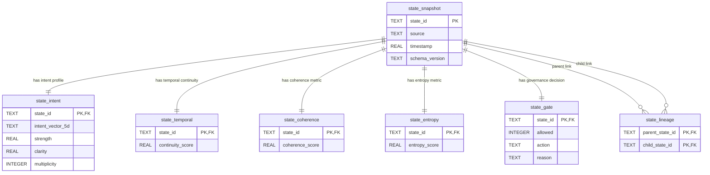

# Logenesis 1.5

Logenesis 1.5 is a production-oriented reference implementation for RFC-LGN-1.5-001, a **conversational reasoning architecture** (not a generic chatbot).

## Core Pipeline

`User Input -> Constitution -> Context Governor -> Dialogue Ledger -> Reasoning Router -> (Fast|Deliberative) -> Response Planner -> MIRAS Memory Stack`

## Key Safety Guarantees

- Public responses are separated from hidden internal reasoning.
- Optional multi-path reasoning is bounded and internal-only.
- Unverified reasoning cannot commit to long-term memory.
- Long-term memory writes are only possible via MIRAS Commit Gate.
- Context continuity is derived from structured state, not full transcript replay.

## Repository Map

- `docs/` architecture, RFC rewrite, schema docs, flows, and decisions
- `src/logenesis/` implementation modules
- `tests/` unit/integration skeleton with deterministic fixtures
- `config/` example policies and thresholds
- `examples/` runnable usage flows

## System Architecture Diagram (Database-Oriented)

The platform persistence layer uses a normalized SQLite schema centered on `state_snapshot` and decomposes each state dimension into dedicated tables for auditability and replay.



### Data Flow (State Snapshot Write)

1. Runtime emits a new `StateSnapshot` candidate.
2. `LogenesisStateStore.write_snapshot(...)` writes base record into `state_snapshot`.
3. Derived dimensions are split into `state_intent`, `state_temporal`, `state_coherence`, `state_entropy`, and `state_gate`.
4. Optional parent-child relationship is recorded in `state_lineage` for trajectory/audit traversal.

This design keeps each governance dimension queryable without exposing hidden reasoning traces directly.

## Quick Start

```bash
python -m venv .venv
source .venv/bin/activate
pip install -e .[dev]
pytest
```

## Minimal API Run

```bash
uvicorn logenesis.api.server:app --reload
```

Then call `POST /v1/conversation/turn`.

## Architecture-first Notes

- External model providers are abstracted behind `LLMProvider`.
- Verification is modular (`process`, `factual`, `context`, `commitment`).
- Memory is split into working, episodic, semantic, DiffMem, and commit controls.
- RSI is post-episode only and does not mutate active constitutional policy mid-episode.

## Limitations

- This repository includes mock/stub providers and deterministic defaults.
- It does not include cluster-scale training pipelines.

## Proposed Next Functions / Extension Directions

1. **State replay API endpoints**
   - Add read APIs for lineage traversal (`ancestors`, `children`, `path-to-root`) to support explainable trajectory playback.
2. **Snapshot quality dashboards**
   - Build metrics views for continuity/coherence/entropy drift over time by session and intent class.
3. **Commit-gate observability bridge**
   - Join verifier outputs with `state_gate` outcomes to diagnose abstain/allow thresholds and false-allow risks.
4. **Semantic compaction workers**
   - Periodically compress stable episodic patterns into semantic candidates while preserving DiffMem lineage.
5. **Policy simulation sandbox**
   - Re-run historical snapshots against alternative constitution/verifier policies for offline calibration.
6. **Risk-triggered retrieval tuning**
   - Auto-adjust retrieval depth/window by entropy + contradiction indicators to reduce topic drift.
7. **State anomaly detection hooks**
   - Detect unusual transitions (e.g., coherence collapse after topic switch) and surface repair prompts.
